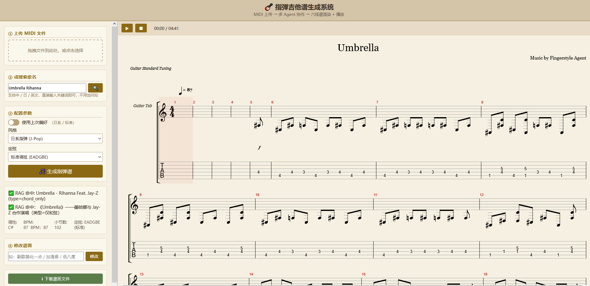

# 🎸 指弹吉他谱生成多 Agent 系统

> MIDI 上传 → 6 Agent 协作 → 六线谱渲染 + 播放 + 下载

[](https://github.com/LambProgrammer/fingerstyle-agent/actions/workflows/ci.yml)


---



## 功能

- 🎹 MIDI 文件上传，自动生成指弹吉他六线谱（TAB）
- 🔍 多语言歌名语义搜索（中/日/英），RAG 曲谱库自动匹配
- 🎸 三种指弹风格（日系 / 美式 / 流行改编）+ 五种定弦
- ✏️ 自然语言修改谱面（"副歌简化一点""加滑音"）
- 🎵 alphaTab 六线谱渲染 + Web 音频播放
- 💾 .gp5 格式下载（Guitar Pro 8 / TuxGuitar 打开）
- 🧠 跨会话记忆：刷新恢复进度，重开记住偏好

---

## 快速开始

> **前置条件**：Docker Desktop 已安装运行，DeepSeek API Key 已获取。

```bash
# 1. 拉取镜像
docker pull lambprogrammer/fingerstyle-agent:v1.0

# 2. 下载数据包并解压到项目目录
#    GitHub Releases → data.tar.gz → 解压到 ./data/

# 3. 配置环境变量
cp .env.example .env
# 编辑 .env，填写 DEEPSEEK_API_KEY（必填，否则 Agent 决策节点不工作）

# 4. 启动
docker compose up -d

# 5. 打开浏览器
#    http://localhost:8000       — 上传 MIDI、生成指弹谱
#    http://localhost:8000/docs  — Swagger API 文档
```

---

## Agent 架构

```
MIDI 上传 → Agent 1 旋律解析 → Agent 2 和声编排 → Agent 2.5 LLM 编曲决策
              ↓                                        ↓
         Agent 3 指法生成 ←── Agent 4 物理校验 ←──┘
              ↑                    │
         Agent 5 修改理解 ←────────┘
```

**6 Agent 节点，两层决策架构：**

| 层 | 节点 | 职责 | LLM |
|----|------|------|:--:|
| 编曲层 | Agent 2.5 | 歌曲摘要 → 段落编排参数 | ✅ |
| 编曲层 | Agent 4→3 回退 | 谱面审听报告 → 段落参数调整 | ✅ |
| 执行层 | Agent 5 | 用户指令 → 结构化修改操作 | ✅ |
| 执行层 | Agent 1/2/3/4 | MIDI 解析 / 和声分析 / 指法生成 / 物理校验 | ❌ 确定性规则 |

> LLM 做编曲判断（选择题），确定性规则做乐器执行（计算题）。详见 [项目章程](docs/project-charter.md)。

---

## 技术栈

| 领域 | 技术 |
|------|------|
| API | FastAPI + Swagger UI |
| Agent 编排 | LangGraph + LangChain |
| LLM | DeepSeek (V3 / V4 Pro) |
| 乐理引擎 | music21 |
| 向量检索 | Chroma + sentence-transformers |
| 短期记忆 | PostgreSQL (Checkpointer) |
| 长期记忆 | Redis |
| 前端渲染 | alphaTab + MusicXML |
| 容器化 | Docker Compose |
| CI / 质量 | GitHub Actions + Ruff + Pytest |

---

## 评估指标

> 发布前采集终值，详见 [evals/](evals/)。

| 指标 | 说明 |
|------|------|
| 物理校验通过率 | 生成 TAB 经人手物理约束校验的通过比例 |
| 旋律保真率 | TAB 反算音高 vs 原 MIDI 旋律音高的覆盖率 |
| 声部 zone 合规率 | 旋律/低音/内声部在指定弦区的分配准确率 |
| Agent 5 指令解析准确率 | 自然语言 → 结构化操作的 op + scope 匹配率 |
| RAG hit@1 | 多语言歌名检索首位命中率 |

---

## API

所有接口详见 Swagger UI：http://localhost:8000/docs

| 端点 | 说明 |
|------|------|
| `POST /upload` | 上传 MIDI / GP5 文件，或搜索歌名 |
| `POST /modify` | 自然语言修改谱面（如"副歌简化"） |
| `GET /render/{id}` | MusicXML 六线谱渲染 |
| `GET /download/{id}` | .gp5 文件下载 |
| `GET /preferences` | 用户偏好（风格/定弦） |

---

## 项目文档

- [项目章程](docs/project-charter.md) — 技术栈 / 架构映射 / ADR / 里程碑
- [进度记录](docs/PROGRESS.md) — 已完成 / 进行中 / Bug 清单 / 技术决策
- [评估体系](evals/) — 三层 evals（确定性 / LLM 决策 / RAG 检索）
- [发布检查清单](docs/release-checklist.md) — v1.0 交付前自查
